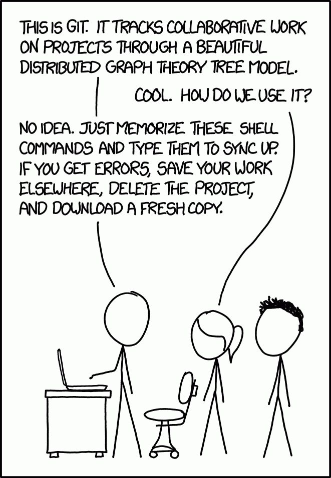

My Project
Next line of my Project
Other line
I need to highlight these <mark>very important words</mark>.

Gone camping! :tent: Be back soon.

That is so funny! :joy:

- [x] Write the press release
- [ ] Update the website
- [ ] Contact the media

Here's a simple footnote,[^1] and here's a longer one.[^bignote]

[^1]: This is the first footnote.

[^bignote]: Here's one with multiple paragraphs and code.

    Indent paragraphs to include them in the footnote.

    `{ my code }`

    Add as many paragraphs as you like.

This is a funny picture

